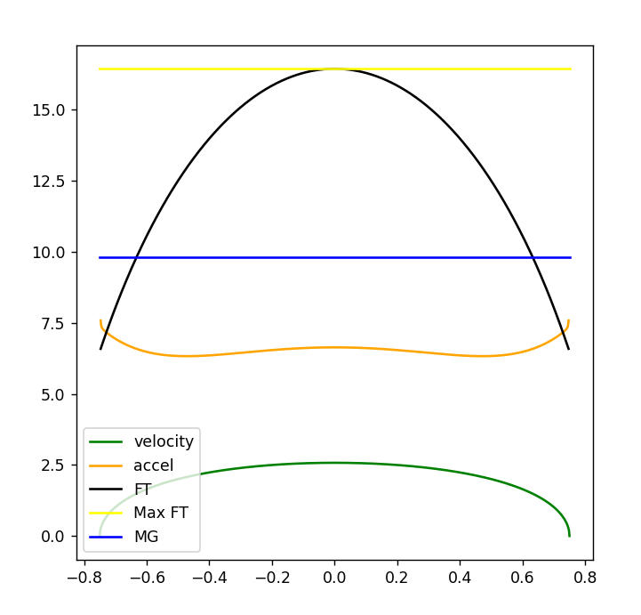

# Physics Engine

Python program for simulating pendulum physics.




## Features:
 - Adjust any of the settings below:
```python
# Settings
ENABLE_POINTS = True
ENABLE_VEL_VECTORS = True
ENABLE_ACCEL_VECTORS = True
ENABLE_FT_VECTORS = True
ENABLE_MG_VECTORS = True

start_x = -0.75 #meters
end_x = 0.75 #meters
n_points = 1000 #number of points to simulate

# Constants
g = 9.8 #m/s/s
mass = 1 #kg
length = 1 #meter
```

## Math
### Position
Derived by assuming the pendulum string length remains constant (ie: pendulum moves in circle)

```python
x = start_x + n * x_delta
y = -((length ** 2 - x ** 2) ** 0.5)
points.append((x, y))
```

### Velocity
Direction is obtained by finding angle between next and previous points.
Magnitude is obtained from conservation of energy (PE = KE)

```python
delta_h = y - y_start
vel_mag = (2 * g * -delta_h) ** 0.5 #velocity = sqrt(2 * g * delta_h)

#Find direction (check previous and next points)
x1, y1 = get_prev_point(points, n)
x2, y2 = get_next_point(points, n)
v_angle_rad = math.atan2(y2 - y1, x2 - x1)

velocities.append(Vector(vel_mag, v_angle_rad))
```

### Acceleration
Direction and Magnitude are obtained by subtracting the adjacent velocity vectors and dividing by time.
Time is obtained from the distance between the points and the velocity between them.

```python
dx = math.cos(vec2.angle) * vec2.mag - math.cos(vec1.angle) * vec1.mag
dy = math.sin(vec2.angle) * vec2.mag - math.sin(vec1.angle) * vec1.mag


#Calc factor to divide by
x1, y1 = get_prev_point(points, n)
x2, y2 = get_next_point(points, n)
dist = ((x1 - x2) ** 2 + (y1 - y2) ** 2) ** 0.5
time = dist / velocities[n].mag

accels.append((dx / time, dy / time))
```

### Weight
weight = mass * gravity
```python
MG_y = -g * mass
```

### Force Tension
FT - mg = ma
```python
FT_y = accel_y * mass - MG_y
FT_x = accel_x * mass #Force Tension is only horizontal force
```
